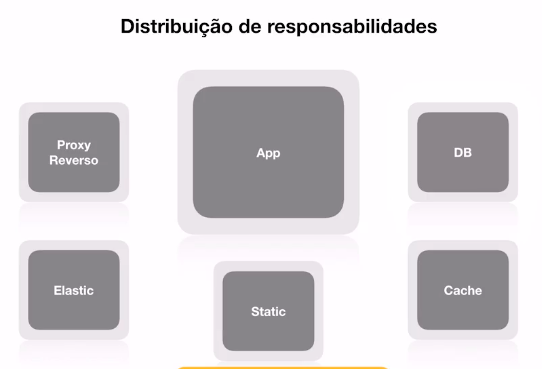

# Desenvolvimento de Aplicações Modernas e Escaláveis com Microsserviços
Repositório para anotações do curso - Desenvolvimento de Aplicações Modernas e Escaláveis com Microsserviços

## Arquitetura

### Pilares
- Organização de sistemas
- Componentização
- Relacionamento entre sistemas
- Governança
- Ambiente
- Projeto
- Projeção
- Cultura
  
### Frameworks 
- Nos ajudam a definir o padrão e trabalho (ferramenta ou método)
- TOGAF (Framework conceitual)
  - Visão geral dos diferentes tipos de arquitetura (Negócio, Sistemas de informação, Tecnlogia...)
- `ISO/IEC/IEEE 42010 - Systems and software engineering - Architecture description`

### Escabalidade e sistemas monolitos
(Vale lembrar que na maioria dos casos o monolito atende o negócio)

- Tudo dentro do mesmo sistema
- Alto acoplamento
- Processo de deploy "completo"
- Normalmente utiliza uma unica tecnologia
- Um erro afeta o sistema todo
- Complexidade maior para os times (conflitos)

* Escalando
  1. Escala vertical: A medida que os acessos vão aumentando, são aumentados os recursos computacionais
  2. Escala horizontal: Nessa abordagem é aumentada a quantidade de máquinas apenas (Um load balancer irá balancear a carga entre essas máquinas)
 
 ***Detalhes sobre arquitetura da aplicação***
- Disco efêmero (os dados ficam por um tempo determinado). Quando a maquina é destruida as informações se perdem
- Servidor de aplicação e servidor de assets (upload de imagem por exemplo). 
- Cache centralizado
- Sessões centralizadas
> Tudo pode ser criado e destruido facilmente

### Distribuição de responsabilidades

 
### Escala horizontal (Aplicação monolitica)
- Ter imagens/containers
- Ser facilmente reconstruido.
- Ter suas responsabilidades (incluindo assets)

***Quando uma aplicação monolitica deixa de valer a pena?***
- Times grandes, geram conflitos gigantescos, é alterado alguma parte do código que influência outra
- Necessidade de escalar todo o sistema por conta de uma unica área que esteja com pico de utilização
- Risco de um deploy completo começa a se elevar (qualquer alteração em uma ponta afeta a outra. "Será que vale a pena fazer o deploy por conta de uma alteração pequena?")
- Necessidade de utilizar tecnologias diferentes

### Microserviços

- Principais caracteristicas
    - Componentização via Serviços
      - Uma unidade de software independente que pode ser substituida ou atualizada.
      
      ***Desvantagens:***
         - chamadas externas são bem mais custosas do que chamadas locais.
         - Cruzamento entre componentes pode se tornar complexo.
         - Transações entre serviços são o "grande desafio"
         - Mudanças bruscas em regras de negócio pode afetar diversos serviços.
 
- Organização em torno do negócio

    Um  projeto baseado em um ou mais produtos que trabalham em diferentes contextos.
    
    - Time de desenvolvedores por produto.

- Smart endpoints & dumd pipes
    - Exposição de APIs
    - Comunicação entre microserviços
    - Comunicação sincrona e assincrona
    - Utilização de sistemas de mensageria
    - Garantia que um serviço vai ser executado utilizando filas
    
- Governança descentralizada
    - Ferramenta certa para o trabalho certo. Tecnologias podem ser definidas baseadas na necessidade do produto.
    - Diferentes padrões e ferramentas entre os squads
    - Contratos de interface de forma independente

- Automação de infra
    - cloud computing
    - testes automatizados
    - CI/CD
    - Load balancer / Autoscaling
    
- Desenhado para falhar
    - Tolerante a falha
    - Serviços que se comunicam precisam de um fallback
    - Logs
    - Monitoramento em tempo real
    - Alarmes
    
- Design evolutivo
    - Produtos podem ser evoluidos ou ser extintos por razão de negócio
    - Gerenciamento de versão
    - Replacement and upgradabily (independente de tecnologia)
